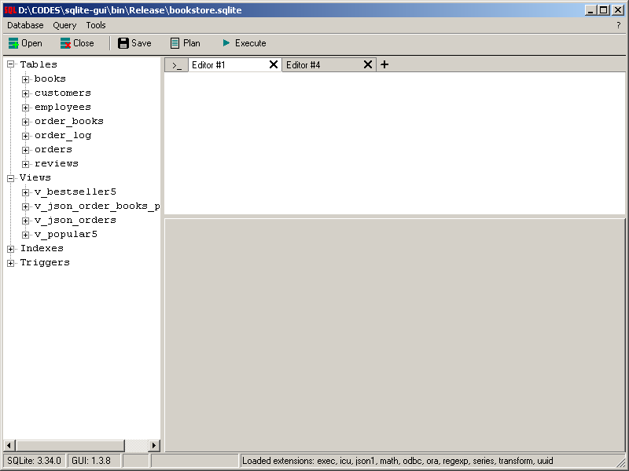

sqlite-gui is a lightweight Windows GUI for [SQLite](https://www.sqlite.org/index.html) powered by C++, WinAPI and [Code::Blocks 17](http://www.codeblocks.org/).  
Small, simple, powerfull, fast, free.

|[**Download the latest version**](https://github.com/little-brother/sqlite-gui/releases/latest)|
|-------------------------------------------------------------------------------------------|

### Features
* Syntax highlighting and code completion
* Edit multiple tables at the same time
* Colorized data grid
* Store an execution history and user scripts
* Export/Import data
* Database diagram
* Database comparison
* Search text in the whole database
* [Quick data references](https://github.com/little-brother/sqlite-gui/wiki#quick-references)
* [Terminal mode](https://raw.githubusercontent.com/little-brother/sqlite-gui/master/resources/terminal.webp)
* [Charts](https://github.com/little-brother/sqlite-gui/wiki#charts)
* [Query parameters](https://github.com/little-brother/sqlite-gui/wiki#query-parameters)
* Data generator
* [Extension pack](https://github.com/little-brother/sqlite-gui/wiki#extensions)
* Demo database "Bookstore" for beginners
* Does not require installation

If you like the project, press the like-button on [AlternativeTo](https://alternativeto.net/software/sqlite-gui/about) or rate the app on [Softpedia](https://www.softpedia.com/get/Internet/Servers/Database-Utils/SQLite-GUI-LB.shtml) to support it. 
If you have any problems, comments or suggestions, check [Wiki](https://github.com/little-brother/sqlite-gui/wiki), create a [Discussion](https://github.com/little-brother/sqlite-gui/discussions) topic or just let me know <a href="mailto:lb.im@yandex.ru?subject=sqlite-gui">lb.im@yandex.ru</a>.
