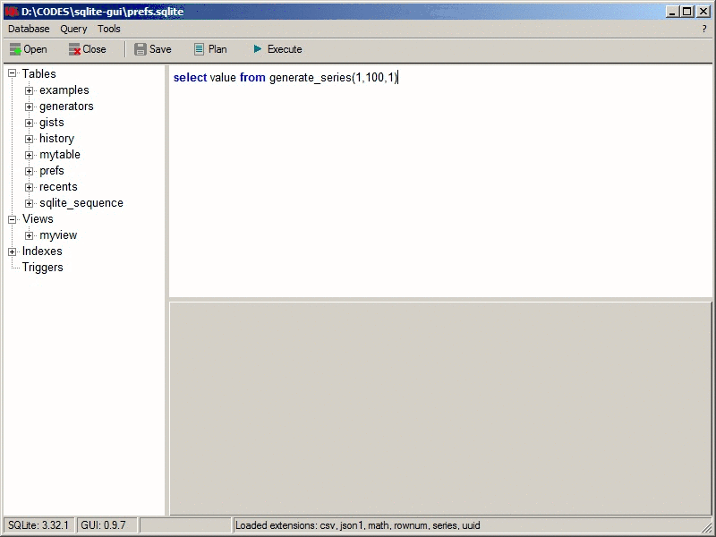

Sqlite-gui is a lightweight GUI for [SQLite](https://www.sqlite.org/index.html) powered by C++, WinAPI and [Code::Blocks](http://www.codeblocks.org/).  
Recent binaries are available at [Releases page](https://github.com/little-brother/sqlite-gui/releases).





### Features
* Syntax highlighting and code completion
* Store an execution history and user gists
* Export/Import data
* Data generator
* Most used extensions are included
* Does not require installation

### Cons
* BLOB is unsupported
* Only utf-8 is supported
* NULL is displayed as an empty string and an empty string is set to NULL when data is edit


<details>
 <summary>How to build sqlite</summary>
  
  * sqlite3.dll + sqlite3.def
    ```
    gcc -shared -Wl,--output-def=sqlite3.def sqlite3.c -o sqlite3.dll -D SQLITE_ENABLE_DBSTAT_VTAB
    ```

 * libsqlite3.a
    ```
    dlltool -d sqlite3.def -l libsqlite3.a -D sqlite3.dll
    ```

 * Extension e.g. iif
    ```
    gcc -I ../include -g -shared iif.c -o iif.dll
    ```
</details>


If you have any problems, comments or suggestions, just let me know <a href="mailto:lb.im@yandex.ru?subject=sqlite-gui">lb.im@yandex.ru</a>.
